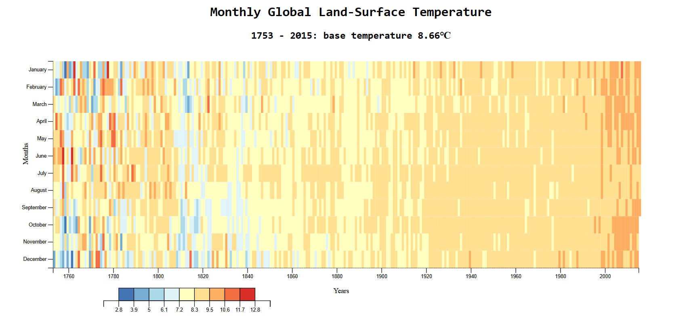

## 📊 Projects

### 1. Bar Chart - US GDP Visualization

**Tech Stack:** D3.js, HTML5, CSS3, JavaScript  
**Description:** Visualizes US GDP data from 1947 to 2015 using D3.js bar chart with tooltip interactions.  
**Live Demo:** [View Project](https://hrishikeshbajirao.github.io/Data-Visualization-Projects-fcc/Bar%20Chart)  
**CodePen:** [Original Pen](https://codepen.io/HrishikeshBajirao/pen/myOyzvr)

---

### 2. Scatterplot Graph - Doping in Cycling

**Tech Stack:** D3.js, HTML5, CSS3, JavaScript  
**Description:** Scatter plot showing cyclist doping allegations with time vs. rank correlation.  
**Live Demo:** [View Project](https://hrishikeshbajirao.github.io/Data-Visualization-Projects-fcc/ScatterPlot%20Graph)  
**CodePen:** [Original Pen](https://codepen.io/HrishikeshBajirao/pen/YPpPMeJ)

---

### 3. Heat Map - Monthly Global Land-Surface Temperature

**Tech Stack:** D3.js, HTML5, CSS3, JavaScript  
**Description:** Heat map visualizing monthly global land-surface temperatures from 1753 to 2015 with color-scaled variance and tooltip interactions.  
**Live Demo:** [View Project](https://hrishikeshbajirao.github.io/Data-Visualization-Projects-fcc/Heat%20Map)  
**CodePen:** [Original Pen](https://codepen.io/HrishikeshBajirao/pen/OPbVMBK)
