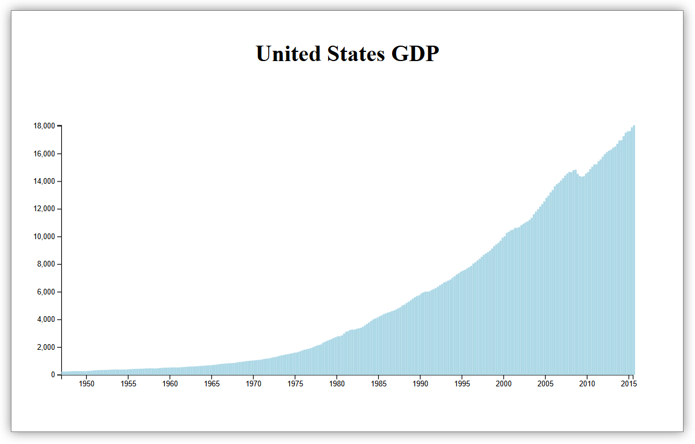
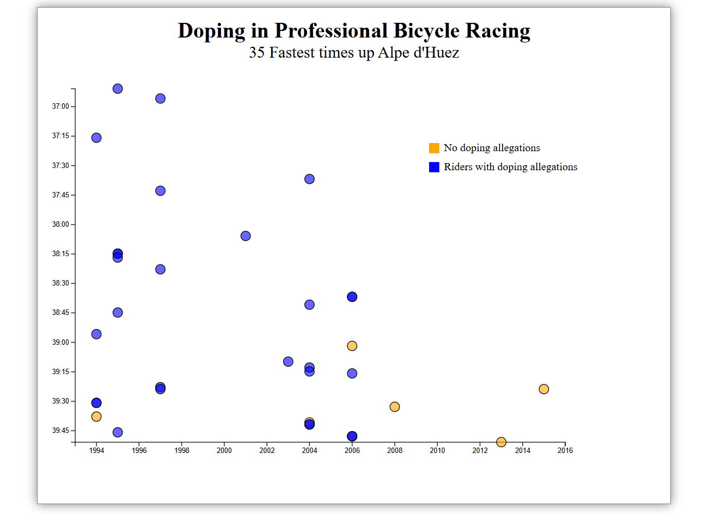

## 📊 Projects

### 1. Bar Chart - US GDP Visualization

**Tech Stack:** D3.js, HTML5, CSS3, JavaScript  
**Description:** Visualizes US GDP data from 1947 to 2015 using D3.js bar chart with tooltip interactions.  
**Live Demo:** [View Project](https://hrishikeshbajirao.github.io/Data-Visualization-Projects-freecodecamp-certification-/bar-chart/)  
**CodePen:** [Original Pen](https://codepen.io/HrishikeshBajirao/pen/myOyzvr)

---

### 2. Scatterplot Graph - Doping in Cycling

**Tech Stack:** D3.js, HTML5, CSS3, JavaScript  
**Description:** Scatter plot showing cyclist doping allegations with time vs. rank correlation.  
**Live Demo:** [View Project](https://hrishikeshbajirao.github.io/Data-Visualization-Projects-freecodecamp-certification-/scatterplot/)  
**CodePen:** [Original Pen](https://codepen.io/HrishikeshBajirao/pen/YPpPMeJ)
